<div align="center">

# 🔀 SFGLab — Signal Flow Graph Analyzer

### An interactive Angular + Flask application that turns a hand-drawn Signal Flow Graph into a symbolic transfer function using **Mason's Gain Rule**

*Draw nodes and branches on a canvas, assign symbolic gains (`G1`, `-H1`, `1/s`, `s+2`…), and get every forward path, loop, non-touching loop combination, Δ, Δₖ and the final simplified T(s) — computed symbolically with SymPy.*


</div>

---

## 📑 Table of Contents

1. [Overview](#-overview)
2. [The Math: Mason's Gain Rule](#-the-math-masons-gain-rule)
3. [Feature Tour](#-feature-tour)
4. [System Architecture](#-system-architecture)
5. [Tech Stack](#-tech-stack)
6. [Repository & File Structure](#-repository--file-structure)
7. [Backend Deep Dive](#-backend-deep-dive)
8. [Frontend Deep Dive](#-frontend-deep-dive)
9. [Data Model](#-data-model)
10. [REST API Reference](#-rest-api-reference)
11. [Key Flows (Sequence Diagrams)](#-key-flows-sequence-diagrams)
12. [Worked Example](#-worked-example)
13. [Design Patterns](#-design-patterns)
14. [OOP Principles & SOLID](#-oop-principles--solid)
15. [Data Structures & Algorithms](#-data-structures--algorithms)
16. [Validation & Security Model](#-validation--security-model)
17. [Getting Started](#-getting-started)
18. [Configuration](#-configuration)
19. [Testing](#-testing)
20. [Roadmap](#-roadmap)

---

## 🔭 Overview

**SFGLab** is a two-tier web application for control-systems students and engineers. The user *draws* a signal flow graph (SFG) in the browser; the server *analyses* it and returns the complete Mason's-rule breakdown.

The project is split cleanly into a **presentation tier** (Angular, owns everything visual and interactive) and a **computation tier** (Flask, owns all of the graph theory and symbolic algebra). The two talk through a single stateless endpoint, `POST /calculate`.

| | Backend | Frontend |
|---|---|---|
| **Language** | Python 3.10+ | TypeScript 5.9 |
| **Framework** | Flask + Flask-CORS | Angular 21 (standalone components, no NgModules) |
| **Core library** | SymPy (symbolic simplification) | Cytoscape.js (graph canvas) |
| **Size** | 4 source modules · ~250 lines | 6 components · 3 services · 9 model interfaces |
| **State** | None — fully stateless | Component state + `@Input/@Output` data flow |
| **Dev port** | `5000` | `4200` (`ng serve`) |
| **Tests** | 26 pytest cases | Vitest + jsdom (Angular CLI `*.spec.ts` scaffolds) |
| **Persistence** | None | None (graphs are loaded from / exported to files) |

> **No database, no accounts, no sessions.** Every calculation is a pure function of the graph in the request body, which keeps the backend trivial to reason about, test and deploy.

---

## 📐 The Math: Mason's Gain Rule

Mason's rule gives the overall transfer function of a signal flow graph **without** reducing the diagram step by step:

$$
T(s) \;=\; \frac{Y(s)}{R(s)} \;=\; \frac{\displaystyle\sum_{k=1}^{N} P_k \,\Delta_k}{\Delta}
$$

with

$$
\Delta = 1 - \sum L_i + \sum L_i L_j - \sum L_i L_j L_k + \cdots
$$

| Symbol | Meaning | Where it is computed |
|---|---|---|
| **Pₖ** | Gain of the *k*-th forward path (input → output, no node visited twice) | `routes/calculate.py → find_forward_paths` |
| **Lᵢ** | Gain of the *i*-th individual loop (closed path, no node repeated) | `routes/calculate.py → find_loops` |
| **ΣLᵢLⱼ …** | Products of **non-touching** loop combinations (pairs, triples, …) with alternating signs | `models/mason.py → find_non_touching_loops` |
| **Δ** | The graph determinant | `models/mason.py → compute_delta` |
| **Δₖ** | Δ of the sub-graph that does **not** touch path *k* | `models/mason.py → compute_delta_k` |
| **T(s)** | Final symbolic transfer function, simplified | `models/mason.py → mason_rule` |

*Two loops "touch" when they share at least one node. A loop touches a forward path under the same definition.*

---

## ✨ Feature Tour

| Area | What you can do |
|---|---|
| 🎨 **Interactive canvas** | Click to place nodes, tap two nodes to draw a directed branch, drag nodes around, pan and zoom (15 % – 400 %), fit-to-screen |
| 🧮 **Mason's engine** | Automatic forward paths, loops, non-touching loop combinations of any order, Δ, every Δₖ, and the simplified T(s) |
| 🔣 **Symbolic gains** | Any SymPy-parsable expression: `G1`, `-H1`, `1/s`, `s+2`, `0.5`, `(a+b)*c` |
| 🔁 **Parallel-branch merge** | Drawing a second branch between the same two nodes *adds* its gain to the existing one: `(G1) + (G2)` |
| ♻️ **Self-loops** | Rendered as a curved teal loop on the node, counted as a loop of length 1 |
| 🟢🔴 **Input / output marking** | Pick source and sink from dropdowns; the nodes get a green / red ring on the canvas |
| ↩️ **Undo / Redo** | Full snapshot history (`Ctrl+Z`, `Ctrl+Y`, `Ctrl+Shift+Z`) plus toolbar buttons |
| ✏️ **Inspector** | Select a node or branch to see its details; rename a node label or edit a branch gain from the right sidebar |
| 📂 **Import** | Load a graph from a simple `.txt` file with line-level error reporting |
| 🖼️ **Export** | Download the whole canvas as a 2× PNG |
| ✅ **Live validation** | Orphan nodes, dead ends, unreachable nodes and missing input/output are flagged as you draw; a hard validation gate blocks *Calculate* if errors remain |
| 📊 **Results accordion** | Collapsible panels for T(s), forward paths, loops, non-touching loops and Δ / Δₖ |
| 🚫 **Zero-gain guard** | A branch with gain `0` is rejected (it is equivalent to no connection) |

---

## 🏗️ System Architecture

### High-level view

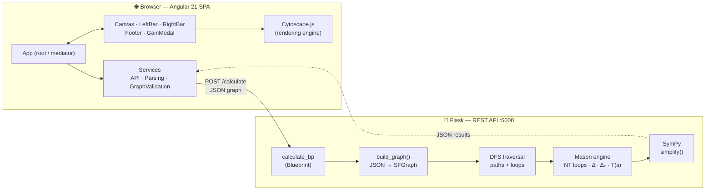

### Backend layering

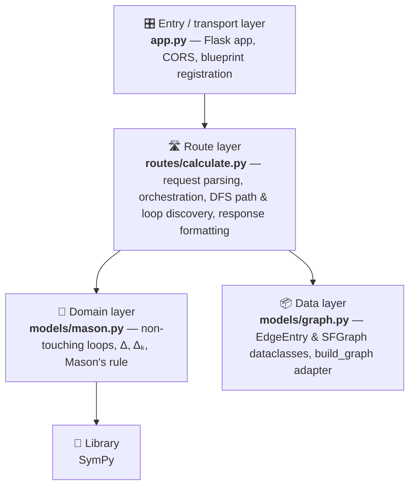

### Frontend layering

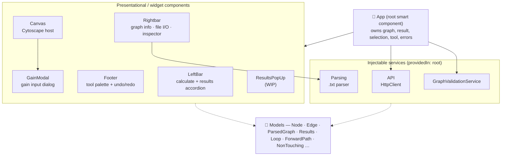

---

## 🧰 Tech Stack

### Backend

| Technology | Role |
|---|---|
| **Python 3.10+** | Language (uses `dataclasses`, `typing`, built-in generics like `list[Any]`) |
| **Flask** | Micro web framework — routing, `request.get_json()`, `jsonify`, test client |
| **Flask Blueprints** | `calculate_bp` keeps the route module self-contained and mountable |
| **Flask-CORS** | Allows the Angular dev server (`:4200`) to call the API (`:5000`) |
| **SymPy** | `sympy.simplify` parses gain strings and algebraically reduces Δ, Δₖ and T(s) |
| **itertools** | `combinations` generates candidate non-touching loop sets |
| **dataclasses** | `EdgeEntry`, `SFGraph` — lightweight typed containers |
| **pytest** | Test runner, with Flask's `test_client()` fixtures |

`requirements.txt` lists `flask`, `flask-cors`, `sympy` (unpinned).

### Frontend

| Technology | Version | Role |
|---|---|---|
| **Angular** | ^21.2 | SPA framework — **standalone components**, built-in `@if` / `@for` control flow, new `application` builder |
| **TypeScript** | ~5.9 | Strict typing across components, services and models |
| **Cytoscape.js** | ^3.33 (+ `@types/cytoscape`) | Graph rendering, hit-testing, drag, zoom/pan, PNG export |
| **RxJS** | ~7.8 | `HttpClient` observables (`Observable<Results>`) |
| **Angular Forms** | ^21.2 | `ngModel` bindings for the I/O dropdowns and gain input |
| **Angular Router** | ^21.2 | Registered with an empty route table (single-screen app) |
| **Vitest + jsdom** | ^4.0 / ^28 | Unit-test runner via `@angular/build:unit-test` |
| **Prettier** | ^3.8 | Formatting (`printWidth: 100`, single quotes, Angular HTML parser) |
| **Plain CSS + custom properties** | — | Design tokens in `Variables.css`; per-component stylesheets (no CSS framework) |
| **Google Fonts** | — | *Syne* (display) and *JetBrains Mono* (math / labels), imported in `Variables.css` |
| **Angular CLI** | ^21.2.8 | Build, serve, test, scaffolding |

---

## 📂 Repository & File Structure

```text
Control-Systems-SFG-master/
├── README.md
│
├── BackEnd/                                  🐍 Flask application
│   ├── app.py                                Entry point: Flask(), CORS(), register blueprint, run on :5000
│   ├── requirements.txt                      flask · flask-cors · sympy
│   ├── models/
│   │   ├── __init__.py
│   │   ├── graph.py                          EdgeEntry + SFGraph dataclasses · build_graph(payload)
│   │   └── mason.py                          Non-touching loops · Δ · Δₖ · mason_rule()
│   ├── routes/
│   │   ├── __init__.py
│   │   └── calculate.py                      POST /calculate · find_forward_paths · find_loops · helpers
│   └── test/
│       ├── test_calculate.py                 8 core API tests
│       └── test_calculate_extended.py        18 tests: symbolic equality, Δ, stress & timing
│
├── FrontEnd/                                 🅰️ Angular 21 application
│   ├── angular.json                          Build / serve / test targets (production + development)
│   ├── package.json  tsconfig*.json          Dependencies and TS configs
│   ├── .prettierrc  .editorconfig            Formatting rules
│   ├── public/favicon.ico
│   └── src/
│       ├── index.html  main.ts  styles.css   Bootstrap (`bootstrapApplication(App, appConfig)`)
│       ├── Variables.css                     🎨 Design tokens (colours, radii, shadows, fonts, layout sizes)
│       ├── environments/
│       │   ├── environment.ts                baseUrl: http://localhost:5000
│       │   └── environment.development.ts    same, swapped in by the "development" configuration
│       └── app/
│           ├── app.ts / app.html / app.css   Root component — orchestrates everything
│           ├── app.config.ts                 provideRouter · provideHttpClient · global error listeners
│           ├── app.routes.ts                 (empty route table)
│           ├── Components/
│           │   ├── canvas/                   ⭐ Cytoscape host: tools, undo/redo, selection, PNG export
│           │   ├── left-bar/                 Calculate button + results accordion
│           │   ├── rightbar/                 Graph stats · file import/export · selection inspector
│           │   ├── footer/                   Tool palette (Select/Move/Add Node/Branch) + Undo/Redo/Delete
│           │   ├── gainmenu/                 Modal for entering / editing a branch gain
│           │   └── results-pop-up/           Numeric T(s) evaluator dialog (UI scaffold, WIP)
│           ├── Models/                       TypeScript interfaces (9 files)
│           └── Services/
│               ├── api.ts                    HttpClient wrapper for POST /calculate
│               ├── parsing.ts                .txt → ParsedGraph parser with error list
│               └── graph-validation.service.ts   Structural graph validation
│
├── Tests/                                    📄 Sample graphs in the .txt import format
│   ├── complex_sfg.txt                       7 nodes · 16 branches
│   ├── complex_sfg_test1.txt                 8 nodes · symbolic gains G1…G9, H1…H5, L1…L3
│   ├── complex_sfg_test2.txt                 7 nodes
│   ├── complex_sfg_test4.txt                 6 nodes
│   └── complex_sfg_test5.txt                 8 nodes · 21 branches
└── package-lock.json                         (empty stub)
```

Each Angular component lives in its own folder as a `.ts` / `.html` / `.css` / `.spec.ts` quartet — a clean separation of logic, template and style.

---

## 🐍 Backend Deep Dive

### `app.py` — composition root

```python
app = Flask(__name__)
CORS(app)                              # open CORS for local development
app.register_blueprint(calculate_bp)   # mounts POST /calculate
app.run(debug=False, port=5000)
```

### `models/graph.py` — the graph model

| Item | Description |
|---|---|
| `EdgeEntry` (`@dataclass`) | One outgoing branch: `to`, `gain` (string), `edge_id` |
| `SFGraph` (`@dataclass`) | `nodes: List[str]`, `adj: Dict[str, List[EdgeEntry]]` (**adjacency list**), `input_node`, `output_node` |
| `build_graph(payload)` | **Adapter** from the JSON request to an `SFGraph`. Creates an empty adjacency list per node, appends every edge to its source's list, auto-creates a source node that was missing, and defaults a missing edge id to `"<src>_<dst>"` |

Gains are deliberately kept as **strings**, never numbers — that is what lets the engine stay symbolic.

### `routes/calculate.py` — orchestration + graph traversal

`calculate()` is a linear pipeline:

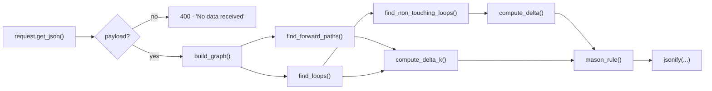

#### Forward-path finder (`find_forward_paths`)

A recursive **depth-first search with backtracking** from the input node. A `visited` list doubles as both the "seen" set and the current path. Whenever the output node is reached, the path and its accumulated gain string are recorded. Each node appears at most once per path, so every result is a valid simple path.

#### Loop finder (`find_loops`)

For every edge `u → v` in the graph, a DFS tries to get from `v` back to `u`. Each closed walk is stored as `[start, …, start]` with its accumulated gain. Because the same cycle is discovered once per starting node (as rotations), results are **de-duplicated** with a `frozenset` of the node ids (see [limitation #3](#-known-limitations--roadmap)).

#### Gain cleaning (`_clean_gain`)

Accumulated gains look like `"2*3*G1*1"`. `_clean_gain` tries to evaluate numeric products, and otherwise strips the `1` factors, so the output is tidy before SymPy ever sees it.

### `models/mason.py` — the Mason engine

| Function | What it does |
|---|---|
| `loops_touch(a, b)` / `loops_touch_path(loop, path)` | Set-intersection of `nodesPath` — "touching" ⇔ share ≥ 1 node |
| `is_valid_combination(combo)` | A combination is valid only if **every pair** inside it is non-touching |
| `find_non_touching_loops(loops)` | For size *i* = 2, 3, 4 … enumerates `itertools.combinations(loops, i)`, keeps valid ones, **stops at the first size with no valid combination** (if no 3 loops are mutually non-touching, no 4 can be). Returns `{size: [combo, …]}` |
| `compute_delta(loops, nt)` | Builds the string `1 - (L1) - (L2) … + (L1*L2) … ` with sign `(-1)^size` for each combination, then `sympy.simplify`s it (falls back to the raw string if SymPy fails) |
| `compute_delta_k(paths, loops)` | For each path: filter to loops that don't touch it, find *their* non-touching combos, compute that sub-graph's Δ |
| `mason_rule(paths, delta, delta_k)` | `Σ Pₖ·Δₖ / Δ`, simplified with SymPy. Returns `"0"` when there is no forward path. Omits the `* (Δₖ)` factor when Δₖ is `"1"` |

### Algorithm walk-through

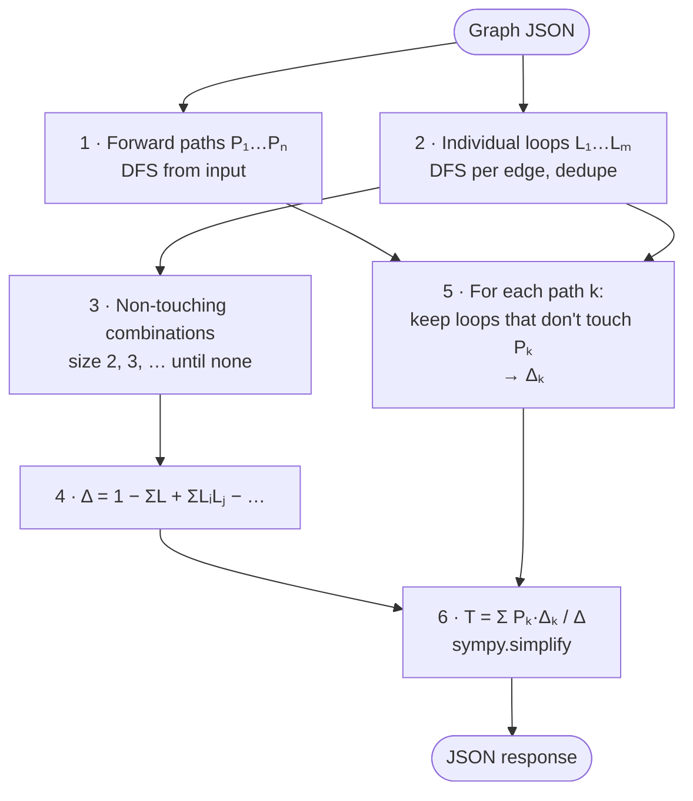

---

## 🅰️ Frontend Deep Dive

### Bootstrap

`main.ts` → `bootstrapApplication(App, appConfig)`. `appConfig` provides `provideBrowserGlobalErrorListeners()`, `provideRouter(routes)` (empty — it is a single-screen tool) and `provideHttpClient()`. No NgModules anywhere.

### The `App` component — the hub

`App` is the **only smart component**. It owns all shared state and wires every child together purely through `@Input` / `@Output`:

| State | Type | Used by |
|---|---|---|
| `graph` | `ParsedGraph` | Canvas (input), Rightbar (input), validation, API call |
| `result` | `Results \| null` | LeftBar and Rightbar |
| `selectedItem` | `any` (node/edge descriptor) | Rightbar inspector |
| `activeTool` | `'select' \| 'move' \| 'add-node' \| 'add-branch'` | Canvas and Footer |
| `currentErrors`, `showErrorModal`, `warningsDismissed` | validation UI | warnings panel + blocking modal |
| `isCalculating` | `boolean` | LeftBar spinner / disabled button |

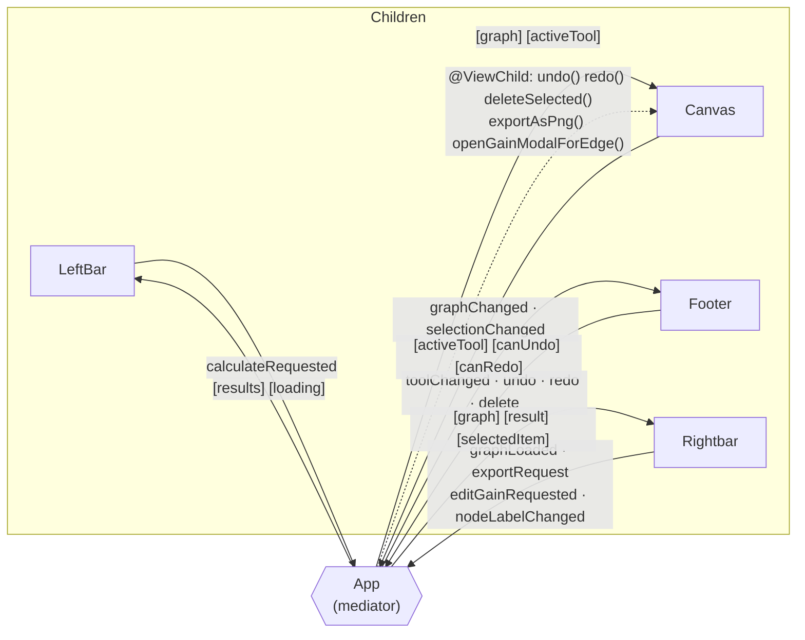

Siblings **never talk to each other directly** — every interaction goes up to `App` and back down.

### Components

| Component | Selector | Responsibility |
|---|---|---|
| `App` | `app-root` | Orchestration, validation gating, API call, warning auto-hide (5 s) |
| `Canvas` | `app-canvas` | Hosts Cytoscape; tool handlers; node/branch creation; I/O node marking; delete; snapshot undo/redo; zoom; PNG export; selection emission; keyboard shortcuts |
| `LeftBar` | `app-left-bar` | Mason formula banner, **Calculate** button with loading state, 5-panel results accordion (T(s), Paths, Loops, Non-touching, Δ) |
| `Rightbar` | `app-rightbar` | Live counts (nodes / branches / loops / paths), status badge, `.txt` upload with error list, image export, selection inspector (inline label edit, "edit gain" button) |
| `Footer` | `app-footer` | Tool palette + Undo / Redo / Delete; disabled states bound to `canUndo` / `canRedo` |
| `GainModal` | `app-gain-modal` | Gain entry with quick chips (`1`, `-1`, `1/s`, `s`, `G1`, `H1`), `Enter` confirms, `Esc` cancels, backdrop click cancels; two modes: `add-branch` / `set-gain` |
| `ResultsPopUp` | `app-results-pop-up` | Static UI for a future numeric-substitution dialog ("Assign numeric values to symbolic gains → compute T(s)"). No logic yet |

### Services

| Service | Responsibility |
|---|---|
| `API` | `calculate(graph): Observable<Results>` → `POST {baseUrl}/calculate` |
| `Parsing` | `parseTxtFile(content): TxtParseResult` — line-by-line parser, collects **all** errors with line numbers instead of failing at the first |
| `GraphValidationService` | `validateGraph(graph): string[]` — structural checks (see [Validation](#-validation--security-model)) |

All three are `@Injectable({ providedIn: 'root' })` tree-shakable singletons.

### Canvas internals — the interesting part

#### Tool state machine

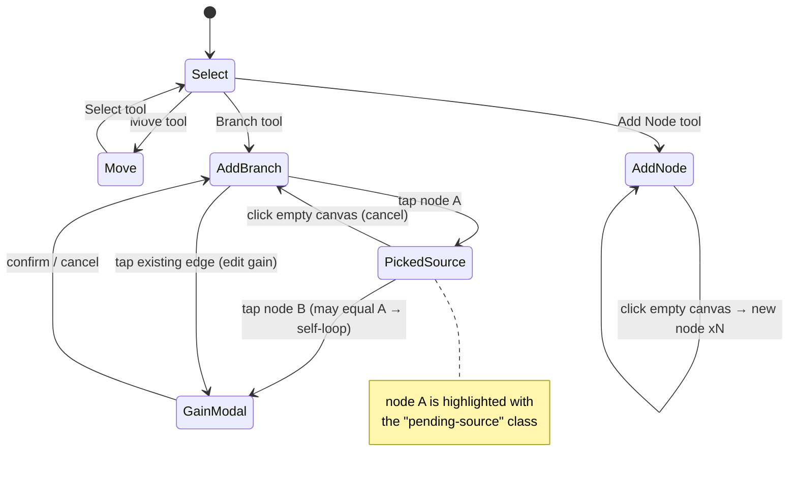

Switching tools clears any pending source and updates the cursor (`default` / `grab` / `crosshair` / `cell`). In add-node and add-branch modes nodes are `ungrabify()`-ed so a click never turns into a drag.

#### Performance: running Cytoscape outside Angular's zone

```ts
this.ngZone.runOutsideAngular(() => this.initCytoscape());
...
this.cy.on('click', 'node', () => this.ngZone.run(() => this.handleBranchNodeTap(id)));
```

Cytoscape fires events at mouse-move frequency; running it **outside** `NgZone` stops every pointer event from triggering change detection. The canvas re-enters the zone (`ngZone.run`) only for the few events that actually change Angular state.

#### Snapshot undo / redo

`pushUndo()` stores a deep clone (`JSON.parse(JSON.stringify(graph))`) of the whole `ParsedGraph` and clears the redo stack. `undo()` / `redo()` swap snapshots between the two stacks, call `renderGraph()` to rebuild the Cytoscape elements, and re-emit the graph.

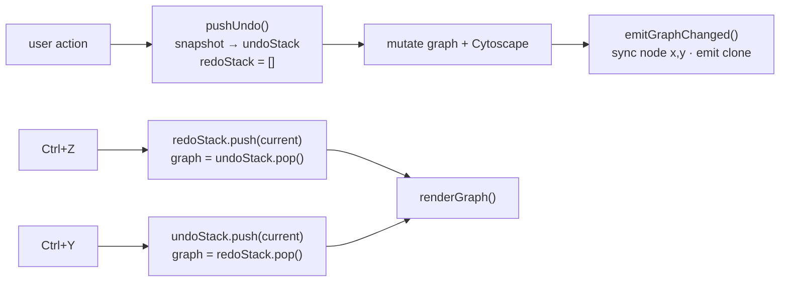

#### Gain-confirmation rules (`onGainConfirmed`)

1. A gain of `0` (via `parseFloat`) is rejected with an alert.
2. **set-gain mode** → overwrite the edge's gain in both Cytoscape and the model.
3. **add-branch mode** and a branch `A → B` already exists → **merge**: `gain = "(old) + (new)"`.
4. Otherwise create a new edge with id `e_<from>_<to>_<timestamp>`; flag `selfLoop` when `from === to` so the stylesheet selector `edge[?selfLoop]` draws it as a curved loop.

#### Visual language (Cytoscape stylesheet)

| Element | Style |
|---|---|
| Node | Dark ellipse `#1a1d2e`, indigo border `#6c63ff`, white JetBrains Mono label |
| Selected node | Magenta border `#E31BDC` |
| **Input node** | **Green** border `#10E349` |
| **Output node** | **Red** border `#F2170C` |
| Pending source | Thick indigo border + tinted fill |
| Edge | Indigo bezier with triangle arrow; gain label auto-rotated along the line |
| Self-loop | Teal `#00b894`, `loop` curve style |
| Selected edge | Gold `#f5c542` |

### Keyboard shortcuts

| Key | Action |
|---|---|
| `Delete` / `Backspace` | Delete the selected node/edge (ignored while typing in an input) |
| `Ctrl/⌘ + Z` | Undo |
| `Ctrl/⌘ + Y` or `Ctrl/⌘ + Shift + Z` | Redo |
| `Enter` / `Esc` (in gain dialog) | Confirm / cancel |

### Styling system

All colours, radii, shadows, fonts and layout sizes are **CSS custom properties** declared once in `src/Variables.css` (`--bg-base`, `--accent-primary`, `--sidebar-width: 280px`, `--radius-md`, `--transition` …) and consumed by every component stylesheet. The layout is a three-column shell: **left sidebar (280 px) · canvas column · right sidebar (240 px)**, with the tool footer docked under the canvas.

---

## 💾 Data Model

There is no database, so the "schema" is the set of shapes exchanged over HTTP.

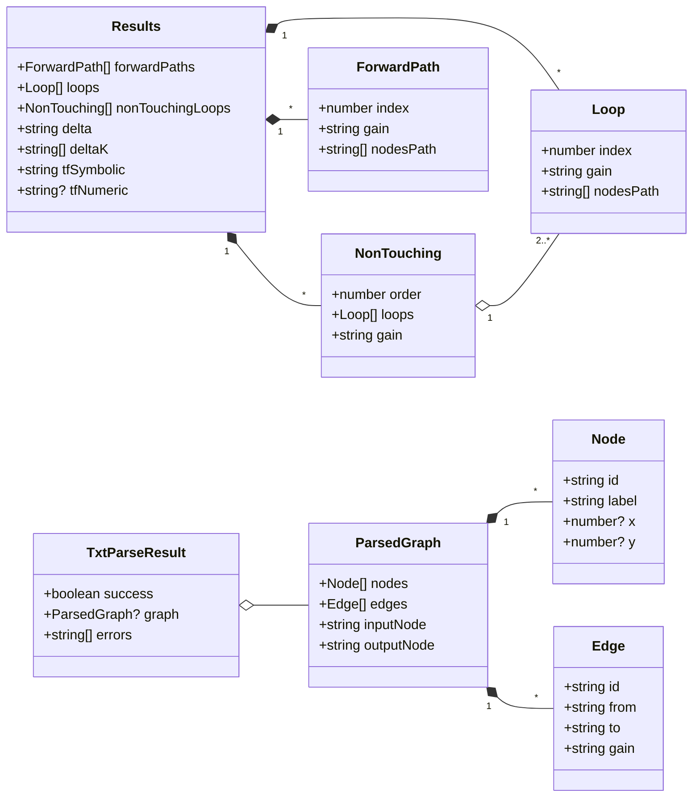

On the Python side the same graph becomes:

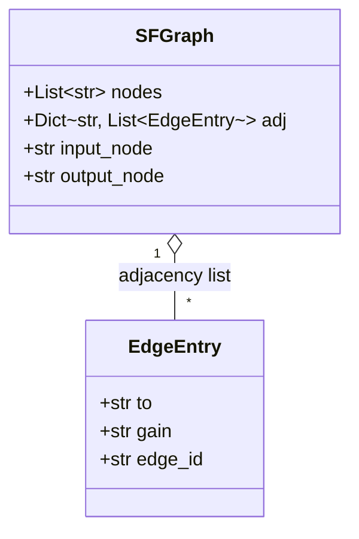

> `Node.label` and `Node.x/y` exist only for the UI. The backend reads **only** `id`, and results always refer to nodes by **id**, not by label.
> `SubPayLoad` (`transferFunction`, `gainValues`, `sValue`) and `Results.tfNumeric` are declared for the upcoming numeric-evaluation feature and are not used yet.

---

## 🌐 REST API Reference

### `POST /calculate`

Computes the complete Mason's-rule breakdown for a graph. Stateless and idempotent.

**Request**

```json
{
  "nodes": [{ "id": "x1" }, { "id": "x2" }, { "id": "x3" }, { "id": "x4" }],
  "edges": [
    { "id": "e1", "from": "x1", "to": "x2", "gain": "G1" },
    { "id": "e2", "from": "x2", "to": "x3", "gain": "G2" },
    { "id": "e3", "from": "x3", "to": "x2", "gain": "-H1" },
    { "id": "e4", "from": "x3", "to": "x4", "gain": "G3" }
  ],
  "inputNode": "x1",
  "outputNode": "x4"
}
```

**Response `200`** *(real output from this repository's code)*

```json
{
  "forwardPaths": [
    { "index": 1, "gain": "G1*G2*G3", "nodesPath": ["x1", "x2", "x3", "x4"] }
  ],
  "loops": [
    { "index": 1, "gain": "G2*-H1", "nodesPath": ["x2", "x3", "x2"] }
  ],
  "nonTouchingLoops": [],
  "delta": "G2*H1 + 1",
  "deltaK": ["1"],
  "tfSymbolic": "G1*G2*G3/(G2*H1 + 1)"
}
```

| Field | Type | Meaning |
|---|---|---|
| `forwardPaths[]` | `{index, gain, nodesPath[]}` | Every simple input → output path |
| `loops[]` | `{index, gain, nodesPath[]}` | Every individual loop; `nodesPath` starts and ends on the same node (a self-loop is `["x2","x2"]`) |
| `nonTouchingLoops[]` | `{order, loops[], gain}` | One entry per mutually non-touching combination; `order` = how many loops it contains |
| `delta` | string | Simplified Δ |
| `deltaK` | string[] | Δₖ per forward path, same order as `forwardPaths` |
| `tfSymbolic` | string | Simplified T(s); `"0"` if there is no forward path |

**Errors**

| Status | When |
|---|---|
| `400` | Empty / non-JSON body — `{"error": "No data received"}` |
| `500` | Malformed graph (e.g. `inputNode` not among the nodes) — unhandled exception, see [limitation #6](#-known-limitations--roadmap) |

---

## 🔄 Key Flows (Sequence Diagrams)

### 1 · Drawing a branch

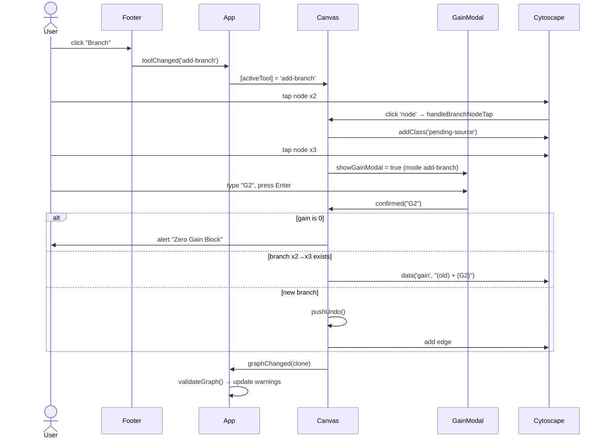

### 2 · Calculate

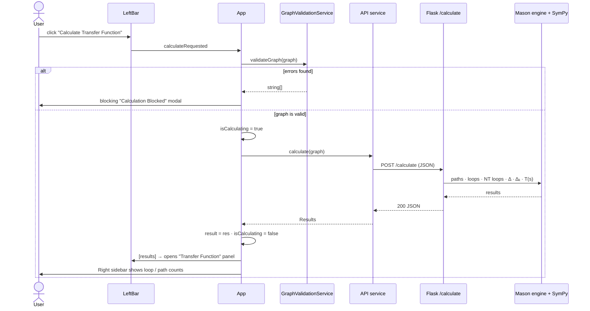

### 3 · Import a `.txt` graph

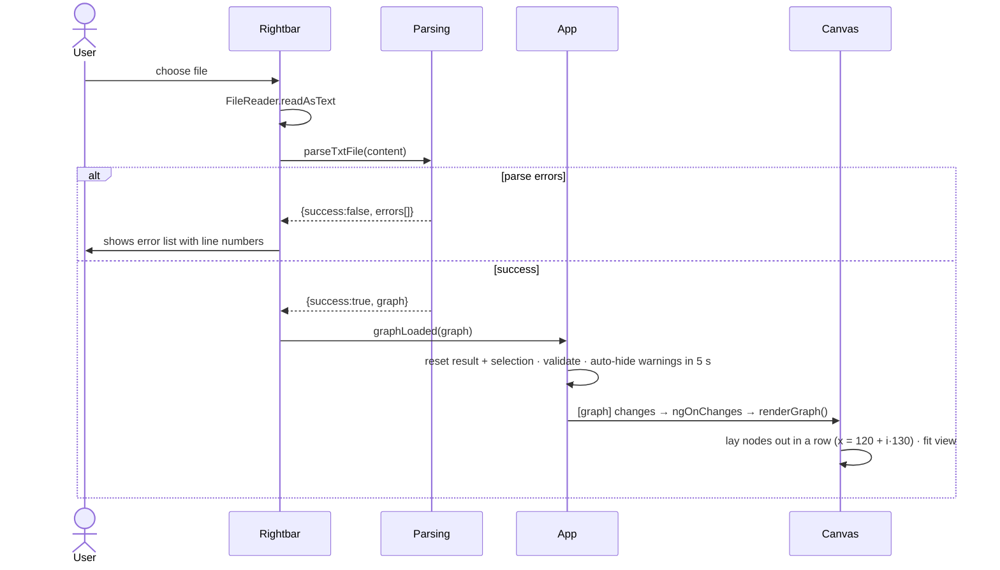

### 4 · Undo

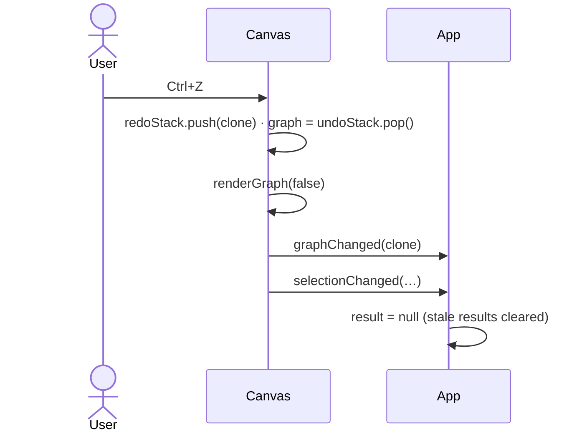

> Any change to the graph sets `result = null` in `App.onGraphChanged`, so the results panels can never show data that no longer matches the canvas.

---

## 🧪 Worked Example

Graph from `POST /calculate` above — a feedback loop between `x2` and `x3`.

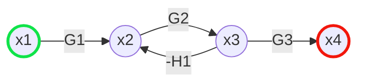

| Step | Result |
|---|---|
| Forward paths | **P₁ = G1·G2·G3** (x1 → x2 → x3 → x4) |
| Loops | **L₁ = G2·(−H1)** (x2 → x3 → x2) |
| Non-touching loops | none (only one loop) |
| Δ | 1 − L₁ = **1 + G2·H1** |
| Δ₁ | L₁ touches P₁ → no loops remain → **1** |
| T(s) | P₁Δ₁ / Δ = **G1·G2·G3 / (1 + G2·H1)** |

### Sample graphs bundled in `Tests/`

Measured with the real engine on the five bundled files:

| File | Forward paths | Loops | Non-touching combos | Time |
|---|---:|---:|---:|---:|
| `complex_sfg.txt` | 7 | 10 | 29 | ~0.01 s |
| `complex_sfg_test1.txt` | 6 | 11 | 25 | ~0.64 s |
| `complex_sfg_test2.txt` | 7 | 10 | 11 | ~0.01 s |
| `complex_sfg_test4.txt` | 6 | 10 | 15 | < 0.01 s |
| `complex_sfg_test5.txt` | 8 | 14 | 50 | ~0.01 s |

### `.txt` file format

```text
// comments start with //
nodes: x1,x2,x3,x4
edges:
x1->x2: G1
x2->x3: G2
x3->x2: -H1
x3->x4: G3
input: x1
output: x4
```

The parser is case-insensitive on the keywords, ignores blank lines and `//` comments, and reports **every** problem it finds (missing sections, malformed edges, unknown node references) with a line number.

---

## 🧩 Design Patterns

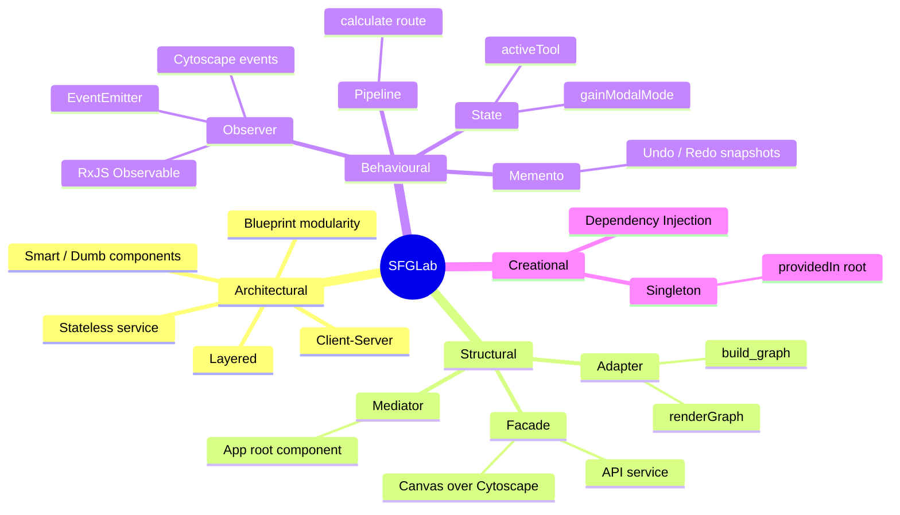

| # | Pattern | Where | Why it is used |
|---|---|---|---|
| 1 | **Client–Server / Separation of tiers** | Angular ↔ Flask over `POST /calculate` | The UI never does graph theory; the server never does UI. Either side can be replaced independently |
| 2 | **Layered architecture** | `app.py` → `routes/` → `models/` | HTTP concerns, orchestration and domain logic live in separate modules |
| 3 | **Blueprint (modular routing)** | `calculate_bp` | Keeps the route self-contained; adding endpoints doesn't touch `app.py` beyond one `register_blueprint` |
| 4 | **Adapter** | `build_graph()` (JSON → `SFGraph`); `Canvas.renderGraph()` (`ParsedGraph` → Cytoscape elements) | Converts between the wire/UI shapes and the shape each algorithm or library wants |
| 5 | **Facade** | `API` service hides `HttpClient` and the URL; `Canvas` hides the whole Cytoscape API behind `undo()`, `renderGraph()`, `exportAsPng()`… | Callers use a tiny, intention-revealing API |
| 6 | **Mediator** | `App` coordinates `LeftBar`, `Canvas`, `Footer`, `Rightbar` | No sibling-to-sibling coupling; every interaction flows through one place |
| 7 | **Observer / Pub-Sub** | `@Output() EventEmitter`s; `HttpClient` `Observable`; `cy.on('click' / 'select' / 'dragfree' / 'zoom')` | Components announce *what happened* without knowing who listens |
| 8 | **Memento (snapshot history)** | `Canvas.undoStack` / `redoStack` of cloned `ParsedGraph`s | Reverts any edit — add, delete, rename, regain, drag — with one mechanism, no per-action inverse logic |
| 9 | **Pipeline** | `calculate()`: build → paths → loops → NT loops → Δ → Δₖ → T(s) | Each stage consumes the previous stage's output; easy to test and extend |
| 10 | **State (lightweight)** | `activeTool` drives cursor, grab behaviour and click semantics; `gainModalMode` switches `add-branch` ↔ `set-gain` | Behaviour varies by mode without scattered flags |
| 11 | **Smart / Dumb (Container–Presentational)** | `App` holds state; `Footer`, `GainModal`, `LeftBar` are driven by inputs and emit events | Reusable, easily testable widgets |
| 12 | **Singleton** | `@Injectable({ providedIn: 'root' })` on `API`, `Parsing`, `GraphValidationService`; module-level Flask `app` | One shared, stateless instance each |
| 13 | **Dependency Injection** | Angular constructor injection (`App(parsing, api, validation, cdr, ngZone)`) | Loose coupling; services can be mocked in tests |
| 14 | **DTO / Contract interfaces** | `Models/*.ts` | A typed contract for everything crossing the HTTP boundary |
| 15 | **Backtracking (recursive DFS)** | `find_forward_paths`, `find_loops` | Natural fit for exhaustively enumerating simple paths and cycles |
| 16 | **Fail-fast / Guard validation** | `GraphValidationService` before the HTTP call; zero-gain rejection | Bad input never reaches the server |
| 17 | **Collect-all-errors parser** | `Parsing.parseTxtFile` | Gives the user the full list of problems in one pass |
| 18 | **Design tokens** | `Variables.css` custom properties | Single source of truth for theming |

---

## 🏛️ OOP Principles & SOLID

> **Honest framing:** the backend is intentionally *functional + dataclass* in style (a handful of pure functions over two dataclasses), while the frontend is where classes, encapsulation and DI are used. Both are shown below.

### The four pillars

| Pillar | Evidence in the code |
|---|---|
| **Encapsulation** | `Canvas` keeps `cy`, `undoStack`, `redoStack`, `pendingBranchSource`, `nodeCounter` **private** and exposes only intentional methods (`undo`, `redo`, `deleteSelected`, `exportAsPng`, `openGainModalForEdge`, `updateNodeLabel`) plus read-only getters (`canUndo`, `canRedo`, `isEmpty`). `App.warningsTimer` is private. On the server, `SFGraph` bundles state with its invariants (nodes + adjacency list); the `_find_*_helper` closures are hidden inside their functions; `_build_dict` / `_clean_gain` are module-private by convention |
| **Abstraction** | `API.calculate()` hides HTTP; `Canvas.renderGraph()` hides Cytoscape element construction; `build_graph()` hides payload parsing; `compute_delta()` hides string building + SymPy. TypeScript interfaces (`Edge`, `Node`, `Results`…) describe *what* data looks like without implementation |
| **Inheritance** | Not used for behaviour — deliberately. Components implement Angular lifecycle **interfaces** (`AfterViewInit`, `OnChanges`, `OnDestroy`); dataclasses are plain value types |
| **Polymorphism** | Interface-based: the same `ngOnChanges` / `ngOnDestroy` contract is honoured differently by each component; structural typing lets any object matching `ParsedGraph` flow through the services; Cytoscape selectors (`node`, `edge[?selfLoop]`, `node.input-node`) style elements polymorphically by class/data |

### SOLID

| Principle | How it shows up | Honest caveat |
|---|---|---|
| **S** — Single Responsibility | `Parsing` only parses; `GraphValidationService` only validates; `API` only does HTTP; `GainModal` only collects a gain; `Footer` only emits tool intents; `models/graph.py` only models, `models/mason.py` only does Mason math | `Canvas` (~620 lines) is the heavy one: rendering, tools, history, selection, shortcuts and export all live there. `routes/calculate.py` mixes HTTP handling with graph traversal |
| **O** — Open/Closed | Add a new validation rule = add a check in one method; add a new API field = extend `Results`; new tool = a new `ToolId` + handler branch | Tools are string-literal unions with `if` branches rather than pluggable objects, so a new tool requires editing `Canvas` |
| **L** — Liskov Substitution | Any object satisfying `ParsedGraph` / `Results` can replace another; `Canvas`, `Footer` etc. honour the Angular lifecycle contracts | Few class hierarchies exist, so there is little to violate |
| **I** — Interface Segregation | Small, focused interfaces: `Edge` (4 fields), `Loop`, `ForwardPath`, `TxtParseResult`; each component exposes only the `@Input`/`@Output`s it needs | `selectedItem` is typed `any`, a loose spot in an otherwise narrow contract |
| **D** — Dependency Inversion | `App` receives `Parsing`, `API`, `GraphValidationService` through the injector rather than constructing them, so they can be swapped for mocks; the API base URL comes from `environment.ts` | Depends on concrete service classes rather than abstract tokens; `Rightbar` and `Canvas` still touch `document`/`FileReader` directly |

### Other principles in play

* **Separation of concerns** — UI vs. computation vs. parsing vs. validation are four separate units.
* **Single source of truth** — `App.graph` is the one authoritative copy; children get it via inputs and emit clones back (`cloneGraph()` prevents shared mutation).
* **Unidirectional data flow** — data down via `@Input`, events up via `@Output`.
* **Immutability at boundaries** — the canvas emits a **deep clone** on every change.
* **Statelessness** — the server stores nothing between requests.
* **DRY** — shared tokens in `Variables.css`; shared `Loop` shape reused by `NonTouching`; one `_build_dict` for both paths and loops.
* **Defensive UX** — validation gate, zero-gain guard, input-field check before keyboard shortcuts fire.
* **Performance awareness** — Cytoscape outside the zone; combinatorial early exit in non-touching search.

---

## 📐 Data Structures & Algorithms

| Structure / Algorithm | Where | Purpose / Complexity |
|---|---|---|
| **Adjacency list** (`Dict[str, List[EdgeEntry]]`) | `SFGraph.adj` | O(1) neighbour lookup; O(V + E) space |
| **Recursive DFS + backtracking** | `find_forward_paths`, `find_loops` | Enumerates all simple paths / cycles — **exponential** in the worst case (the number of simple paths and cycles itself can be exponential) |
| **`frozenset` + `set`** | `find_loops` (`seen`), `loops_touch*` | Hashable cycle identity; O(min(a, b)) intersection test for "touching" |
| **`itertools.combinations`** | `find_non_touching_loops` | Generates all size-*i* loop subsets lazily — C(m, i) candidates |
| **Early termination by monotonicity** | same | If no valid *i*-combination exists, no (*i*+1)-combination can — the search stops |
| **Pairwise validity check** | `is_valid_combination` | A set is mutually non-touching iff every pair is non-touching — O(i²) per set |
| **Symbolic simplification** (SymPy) | `compute_delta`, `mason_rule` | Expression parsing + algebraic reduction of Δ, Δₖ and T(s) |
| **String accumulation** | DFS `path_gain` | Gains are concatenated as `a*b*c` strings, then cleaned |
| **Stack pair (undo / redo)** | `Canvas` | LIFO snapshot history |
| **`Set<string>`** | `Canvas.emitSelection`, `GraphValidationService` | De-duplicating incoming/outgoing neighbours; node-id lookup in parser |
| **Linear scans** | `GraphValidationService` | For each node, count in/out edges — O(V·E) (fine at UI scale) |
| **Deep clone** (`JSON.parse(JSON.stringify())`) | `Canvas.cloneGraph` | Snapshot + safe emission |

**Overall cost.** With *m* loops the non-touching search is bounded by Σᵢ C(*m*, *i*) = O(2ᵐ) in the worst case; Δₖ repeats the search once per forward path on the filtered loop set. For hand-drawn textbook graphs (≤ ~10 nodes) this is instantaneous — the largest bundled sample takes well under a second, dominated by SymPy rather than traversal.

---

## 🛡️ Validation & Security Model

### Client-side validation (`GraphValidationService`)

Runs on every graph change (live warnings) **and** as a hard gate before *Calculate*:

| Rule | Message | Triggered when |
|---|---|---|
| Empty graph | *Graph is empty. Add nodes and branches to begin.* | no nodes |
| Missing source | *Explicit Start: Input Node (Source) is not selected.* | `inputNode` empty |
| Missing sink | *Explicit End: Output Node (Sink) is not selected.* | `outputNode` empty |
| Orphan node | *Orphan Node: 'x' has no connections.* | in = 0 and out = 0 |
| Dead end | *Dead End: … no outgoing branches, and is not designated as the Output Node.* | in > 0, out = 0, not the output |
| Unreachable node | *Unreachable Node: … no incoming branches, and is not designated as the Input Node.* | out > 0, in = 0, not the input |

Warnings appear in a floating panel (auto-dismissed after 5 s); calculation attempts with errors open a blocking **"Calculation Blocked"** modal.

### Import validation (`Parsing`)

Missing `nodes:` / `edges:` / `input:` / `output:`, malformed `from->to: gain` lines, missing gains, and references to undeclared nodes (including input/output) are all reported with line numbers.

### Security posture

This is a **learning / local-use** tool. Before exposing it publicly, read limitations [#2](#-known-limitations--roadmap) (arbitrary code evaluation via gains) and [#6](#-known-limitations--roadmap) (no request validation).

| Concern | Current state |
|---|---|
| Authentication / authorisation | None (no users, no state) |
| CORS | `CORS(app)` — open to every origin |
| Server debug mode | `debug=False` ✅ |
| Input validation (server) | Only "body present"; no schema validation |
| Gain evaluation | ⚠️ passes user strings to `eval()` and `sympy.simplify()` |
| Resource limits | ⚠️ none — enumeration cost is exponential in graph size |

---

## 🚀 Getting Started

### Prerequisites

* **Python 3.10+**
* **Node.js 18+** and **npm** (the repo pins `npm@10.9.3`)
* Angular CLI is installed as a dev dependency (`npx ng …`) — or install globally with `npm i -g @angular/cli`

### 1 · Run the backend

```bash
cd BackEnd
pip install -r requirements.txt
python app.py
```

API is now live at **http://localhost:5000**.

### 2 · Run the frontend

```bash
cd FrontEnd
npm install
npm start          # = ng serve
```

Open **http://localhost:4200**.

### 3 · Try it in 60 seconds

1. Click **Add Node** in the bottom toolbar, then click four times on the canvas → `x1 … x4`.
2. Click **Branch**, tap `x1` then `x2`, type `G1`, press **Enter**. Repeat for `x2→x3` (`G2`), `x3→x2` (`-H1`) and `x3→x4` (`G3`).
3. In the canvas top bar, set **Input = x1** and **Output = x4** (they turn green / red).
4. Press **Calculate Transfer Function** in the left sidebar.
5. Expand the accordion panels to explore paths, loops, Δ and Δₖ.

…or skip the drawing: click **Load from File** in the right sidebar and pick any file from `Tests/`.

### Production-style build

```bash
cd FrontEnd
npx ng build          # output → FrontEnd/dist/FrontEnd
```

For the API, serve `BackEnd` behind a production WSGI server (e.g. `gunicorn app:app`) rather than `app.run`.

---

## ⚙️ Configuration

| Setting | Value | Location |
|---|---|---|
| Backend port | `5000` | `BackEnd/app.py` (`app.run(port=5000)`) |
| API base URL (frontend) | `http://localhost:5000` | `FrontEnd/src/environments/environment.ts` (+ `.development.ts`) |
| CORS | Open to all origins | `BackEnd/app.py` (`CORS(app)`) |
| Angular default build config | `production` for `build`, `development` for `serve` | `FrontEnd/angular.json` |
| Bundle budgets | warn 500 kB / error 1 MB (initial); 4 kB / 8 kB per component style | `angular.json` |
| Zoom limits | 0.15× – 4× | `Canvas.initCytoscape` |
| Warning auto-dismiss | 5000 ms | `App.startWarningsAutoHide` |
| Auto-layout on import | row at `y = 220`, spacing `130 px` | `Canvas.renderGraph` |
| PNG export | `scale: 2`, full graph, background `#f0f2f8` | `Canvas.exportAsPng` |
| Prettier | `printWidth 100`, single quotes | `FrontEnd/.prettierrc` |

---

## 🧪 Testing

### Backend — `pytest` (26 tests)

```bash
cd BackEnd
pytest test/
```

| File | Tests | Covers |
|---|---:|---|
| `test_calculate.py` | 8 | single / multiple forward paths, one loop, non-touching loops, no forward path, empty payload → 400, Δ = 1 with no loops, response-key contract |
| `test_calculate_extended.py` | 18 | **symbolic equality** of T(s) via `sympy.simplify(a − b) == 0` (series gains, self-loop, parallel paths, negative feedback, shared loops), Δ with one / two touching / two non-touching loops, loop counts, long chains, diamond graphs, 3-loop complex graph, **stress tests** (10-node chain, many self-loops, many parallel paths) and a 10-second response-time budget |

**Current status: 25 passed · 1 failed.** `test_non_touching_loops` asserts `nonTouchingLoops[0]["size"] == 2`, but the API's key is `"order"` — the test (or the key name) needs aligning.

### Frontend — Vitest

```bash
cd FrontEnd
npm test            # = ng test (Vitest + jsdom)
```

Each component and service ships with a CLI-generated `*.spec.ts`. They are mostly "should create" scaffolds; `app.spec.ts` still contains the default `Hello, FrontEnd` heading assertion, which no longer matches the template.

### Manual regression set

Load each file in `Tests/` and compare against a hand-derived result or the table in [Worked Example](#-worked-example).

---
## Roadmap

### Roadmap ideas

* 🔢 **Numeric evaluation** — finish `ResultsPopUp`: assign values to `G1, H1, s…` and compute `tfNumeric`
* 🔒 **Safe expression parsing** and request schema validation
* 📈 **Bode / pole-zero / step-response plots** from the transfer function
* 🧭 **Highlight on canvas** — click a forward path or loop in the accordion and light it up on the graph
* 💾 **Save / load JSON** (with node positions) in addition to `.txt`
* 🧱 **Block-diagram → SFG** converter
* 🧪 **More tests** — Angular tests for `Parsing` and `GraphValidationService` (pure functions, easy wins), Playwright e2e for the draw → calculate flow
* 🐳 **Docker Compose** (Flask + nginx-served Angular build) and a CI pipeline running `pytest` and `ng test`
* 🌗 **Dark theme** — the design tokens in `Variables.css` already make this a small change

---

<div align="center">

**SFGLab** — draw it, and let Mason's rule do the algebra.

*Angular canvas · Flask engine · SymPy symbolic math*

</div>
